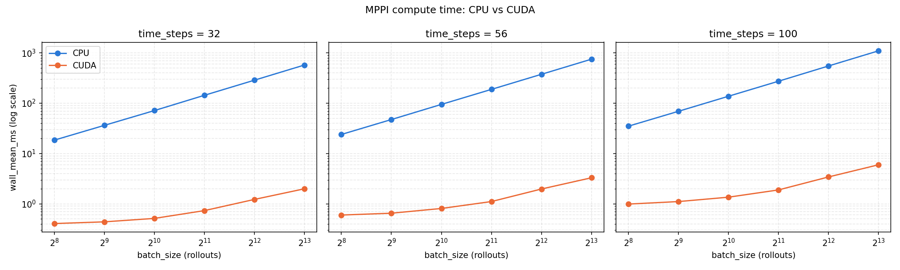

# Model Predictive Path Integral Controller

CUDA version of [mppi_controller_ros](https://github.com/datledoan/mppi_controller_ros), a ROS1 port of [nav2_mppi_controller](https://github.com/ros-navigation/navigation2/tree/main/nav2_mppi_controller), based on the [MPPI-Generic](https://github.com/ACDSLab/MPPI-Generic). Applicable for both [move_base](http://wiki.ros.org/move_base) and [move_base_flex](http://wiki.ros.org/move_base_flex).

>For ROS2-Jazzy, see the [`jazzy`](https://github.com/datledoan/mppi_controller_cuda/tree/jazzy) branch.

>For ROS2-Humble, see the [`humble`](https://github.com/datledoan/mppi_controller_cuda/tree/humble) branch.

# Installation

Requires NVIDIA GPU + CUDA toolkit. Tested with ROS Noetic, Ubuntu 20.04, CUDA 12.4, an AMD Ryzen 5 5500H (8 threads) + RTX 2050 (compute capability 8.6).

* Install CUDA toolkit (see [NVIDIA's install guide](https://developer.nvidia.com/cuda-downloads)) and move_base_flex
    ```sh
    sudo apt install ros-noetic-mbf-costmap-nav
    ```
* Clone code and build
    ```sh
    cd your_ws/src
    git clone https://github.com/datledoan/mppi_controller_cuda.git
    catkin build mppi_controller_cuda
    ```

# Result
## Demo
Run the example with [turtlebot3](https://github.com/datledoan/turtlebot3)


## Benchmark
Benchmark with CPU version [mppi_controller_ros](https://github.com/datledoan/mppi_controller_ros).


Real-run `move_base_flex` CPU usage while navigating a goal in Gazebo
(turtlebot3 burger), sampled with
[`benchmark/run_live_cpu_test.sh`](benchmark/run_live_cpu_test.sh) (10s
window, 0.2s interval, 5 runs x 50 samples each). Both sides run the same
critic set/per-rollout compute cost, same `batch_size`/`controller_frequency`/goal/map:

| Controller | CPU usage (of 1 core, mean ± std across 5 runs) |
|---|---|
| mppi_controller_ros (CPU) | 33.9% ± 0.6 |
| mppi_controller_cuda (GPU) | 21.9% ± 0.2 |

~35% less `move_base_flex` CPU load with the GPU plugin (RTX 2050).

# Reference
- [nav2_mppi_controller](https://github.com/ros-navigation/navigation2/tree/main/nav2_mppi_controller)
- [MPPI-Generic](https://github.com/ACDSLab/MPPI-Generic)
```
@misc{vlahov2024mppi,
      title={MPPI-Generic: A CUDA Library for Stochastic Trajectory Optimization},
      author={Bogdan Vlahov and Jason Gibson and Manan Gandhi and Evangelos A. Theodorou},
      year={2024},
      eprint={2409.07563},
      archivePrefix={arXiv},
      primaryClass={cs.MS},
      url={https://arxiv.org/abs/2409.07563},
}
```
