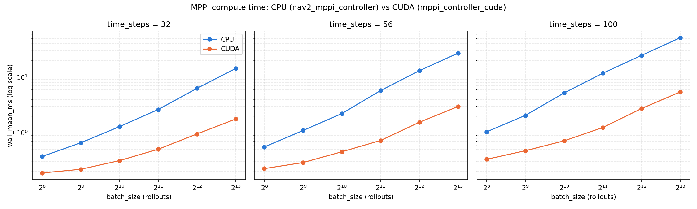

# Model Predictive Path Integral Controller

CUDA-accelerated MPPI controller based on [nav2_mppi_controller](https://github.com/ros-navigation/navigation2/tree/main/nav2_mppi_controller) built on the [MPPI-Generic](https://github.com/ACDSLab/MPPI-Generic) CUDA framework.

>For ROS1, see the [`noetic`](https://github.com/datledoan/mppi_controller_cuda/tree/noetic) branch.

>For ROS2-Humble, see the [`humble`](https://github.com/datledoan/mppi_controller_cuda/tree/humble) branch.

# Installation

Requires an NVIDIA GPU + CUDA toolkit. Tested with ROS2 Jazzy, Ubuntu 24.04, CUDA 12.0, CPU AMD Ryzen 5 5500H (8 threads) + RTX 2050 (compute capability 8.6).

* Install the CUDA toolkit (see [NVIDIA's install guide](https://developer.nvidia.com/cuda-downloads)).
* Clone and build:
    ```sh
    cd your_ws/src
    git clone -b jazzy https://github.com/datledoan/mppi_controller_cuda.git
    cd your_ws
    colcon build --packages-select mppi_controller_cuda
    ```
  `CMAKE_CUDA_ARCHITECTURES` defaults to `86` (this project's own dev GPU). Override for other GPUs, e.g.:
    ```sh
    colcon build --packages-select mppi_controller_cuda --cmake-args -DCMAKE_CUDA_ARCHITECTURES=<your-arch>
    ```

# Usage

Set the plugin type under your `controller_server`'s `FollowPath` in your Nav2 params yaml:

```yaml
controller_server:
  ros__parameters:
    controller_plugins: ["FollowPath"]
    FollowPath:
      plugin: "mppi_controller_cuda::MPPIControllerCUDA"
      # ... see params/mppi_controller_params.yaml for every parameter + its default
```

See [`params/mppi_controller_params.yaml`](params/mppi_controller_params.yaml) for the full list with defaults.
Example with turtlebot3 burger: [turtlebot3](https://github.com/datledoan/turtlebot3.git)

# Result
## Demo

## Benchmark

Real-run `controller_server` CPU usage while navigating a goal in Gazebo
(turtlebot3 burger, see [turtlebot3](https://github.com/datledoan/turtlebot3.git)),
sampled with [`benchmark/run_live_cpu_test.sh`](benchmark/run_live_cpu_test.sh)
(10s window, 0.2s interval, 5 runs x 50 samples each). Both sides run the
same critic set/per-rollout compute cost:

| Controller | CPU usage (of 1 core, mean ± std across 5 runs) |
|---|---|
| nav2_mppi_controller (CPU) | 49.4% ± 0.6 |
| mppi_controller_cuda (GPU) | 28.3% ± 0.5 |

~43% less `controller_server` CPU load with the GPU plugin (RTX 2050).

Per-call compute time (`Optimizer::evalControl()`/`Controller::computeControl()` -- see [`benchmark/`](benchmark/)), swept across `batch_size`/`time_steps`:



# Reference
- [nav2_mppi_controller](https://github.com/ros-navigation/navigation2/tree/main/nav2_mppi_controller)
- [MPPI-Generic](https://github.com/ACDSLab/MPPI-Generic)
```
@misc{vlahov2024mppi,
      title={MPPI-Generic: A CUDA Library for Stochastic Trajectory Optimization},
      author={Bogdan Vlahov and Jason Gibson and Manan Gandhi and Evangelos A. Theodorou},
      year={2024},
      eprint={2409.07563},
      archivePrefix={arXiv},
      primaryClass={cs.MS},
      url={https://arxiv.org/abs/2409.07563},
}
```
